# Morning Hockey

NHL-tulokset, suomalaisten pelaajien pisteet/torjunnat, kausitilastot ja xG-analytiikka
kaikille 32 joukkueelle osoitteessa https://morning-hockey.pages.dev.
Ei ilmoituksia eikä yhtä kovakoodattua joukkuetta: kirjautuminen on kevyt
(käyttäjätunnus, salasana valinnainen), ja oma tili tallentaa suosikkijoukkueet
ja -pelaajat (enintään 30), teeman ja tulospiilo-asetuksen.

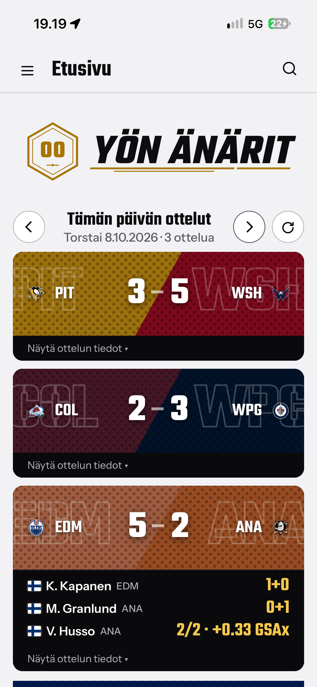

## Ominaisuudet

Valikko: Etusivu, Suosikit, Sarjataulukko, Tilastot, Analytiikka, Joukkueet, Pelit,
Playoff-bracket, Arkisto ja Asetukset. Pelaajahaku on ylä-/sivupalkissa (vähintään 3 merkkiä).

### Etusivu (`/`)
Edellisen illan ottelut suomalaisten pelaajien maali-/syöttö-/torjuntarivein,
klikattava ottelukortti (maaliaikajana, joukkuetilastot, YouTube-highlights),
Suomipörssin ja pistepörssin top 5, suosikkijoukkueiden minilaatikot ja seuraavan
kierroksen ottelut. Päivitysnapin jälkeen näytetään toast-ilmoitus
("Päivitetty klo ..."). Jos tulospiilo on päällä, `/` ohjaa sivulle `/tulospiilo`.

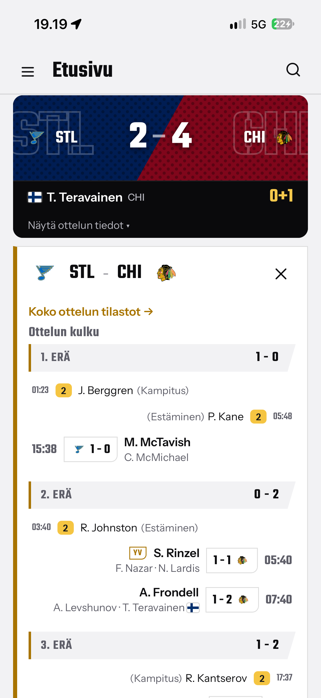

### Suosikit (`/suosikit`)
Kirjautuneen käyttäjän suosikkijoukkueet ja -pelaajat yhdessä näkymässä:
yhteenveto edellisestä pelipäivästä (myös ne suosikit, jotka eivät pelanneet),
tämän illan ottelut joissa on suosikki sekä kausi-/viimeiset 5 ottelua
-tilastotaulukot. Suosikkien hallinta on Asetuksissa.

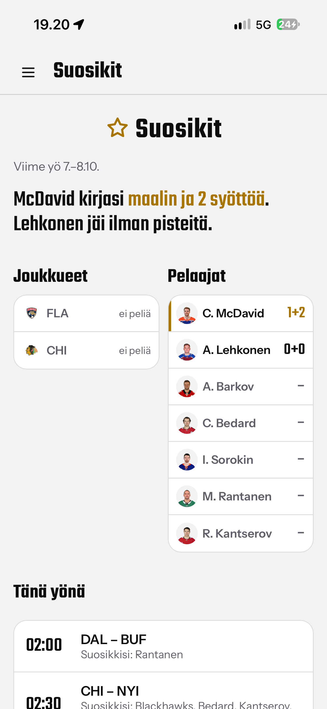

### Sarjataulukko (`/sarjataulukko`)
Divisioonittainen sarjataulukko sekä **Kuntopuntari**: joukkueiden viimeisten
ottelujen form-taulukko (W/L/OTL, järjestys pistekeskiarvon mukaan).

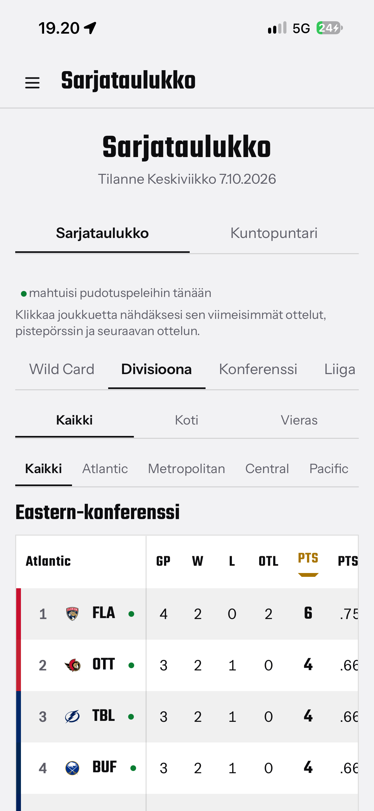 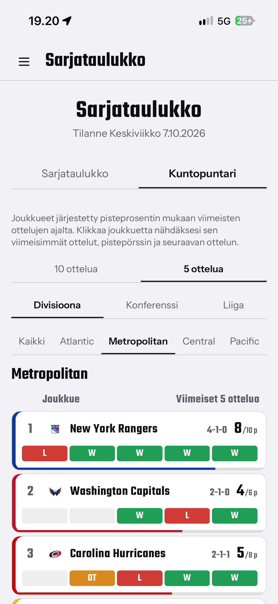

### Tilastot ja analytiikka
- `/tilastot` Pistepörssi (myös rookie-pörssi)
- `/maalivahtiporssi` Maalivahtipörssi, mukana GSAx ja GSAx/100
- `/suomiporssi` Suomipörssi: suomalaisten pisteet ja maalivahdit
- `/odotetut` Edistyneet tilastot: xG-, GSAx- ja joukkue-xGF%-listat
- `/analytiikka` D3-viivakaaviot: divisioonien sarjapisteiden kertymä ja top-10-pelaajien pistekertymä

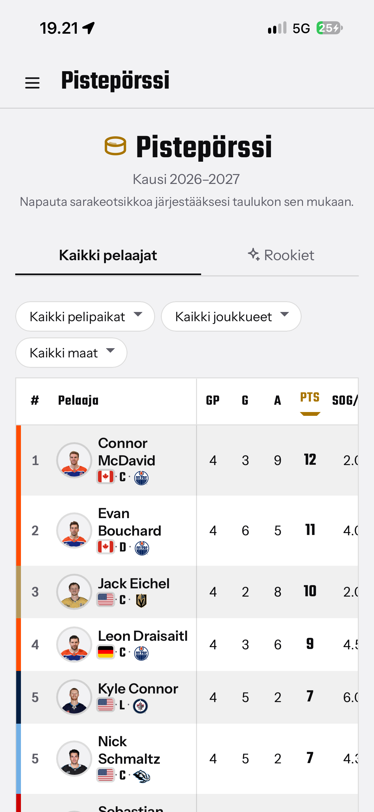 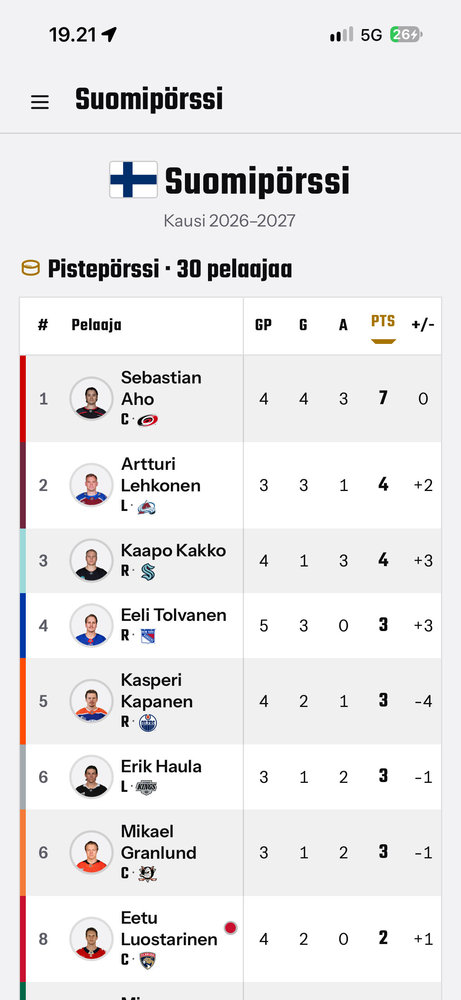 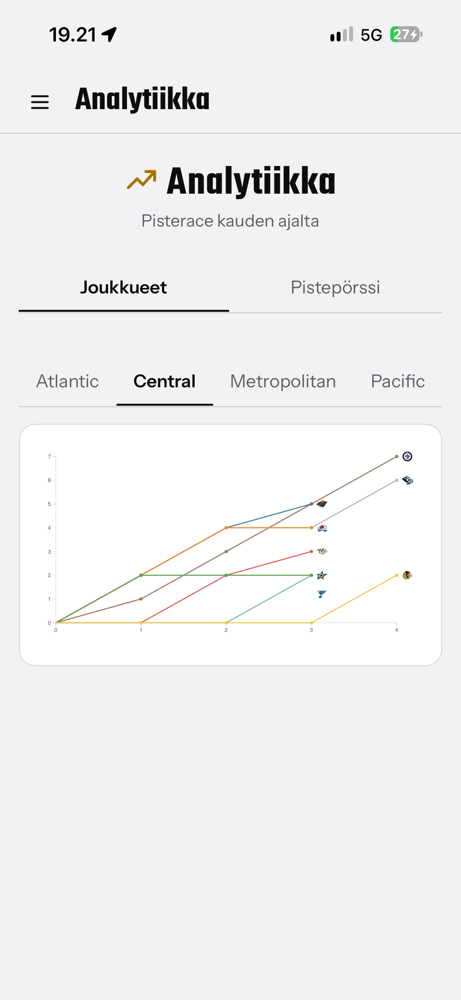 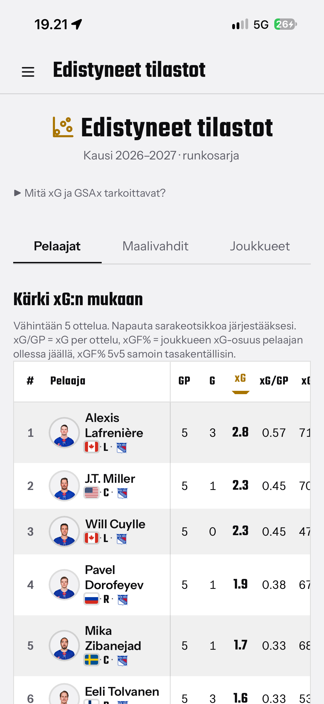

### Playoff-bracket (`/playoffit`)
Ensimmäisen kierroksen pelipari johdettuna sarjataulukosta (divisioonien
kärkikaksikot ja wild cardit).

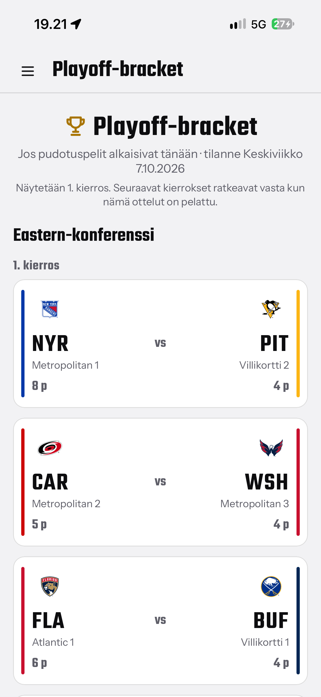

### Pelit
- `/otteluohjelma` seuraavat 8 päivää
- `/primetime` ottelut jotka alkavat klo 18:00-00:30 Suomen aikaa
- `/bingo` Pistemiesbingo: valitse pelaajat lapulle ja katso tulokset
- `/ottelut/<id>` pelatusta ottelusta **raportti** (maalit, pelaajataulukot,
  joukkuetilastot, **Vaaralliset maalipaikat**), tulevasta **esikatselu**
  (kausitilastovertailu, kuntopuntari, kokoonpanot, voittotodennäköisyys)

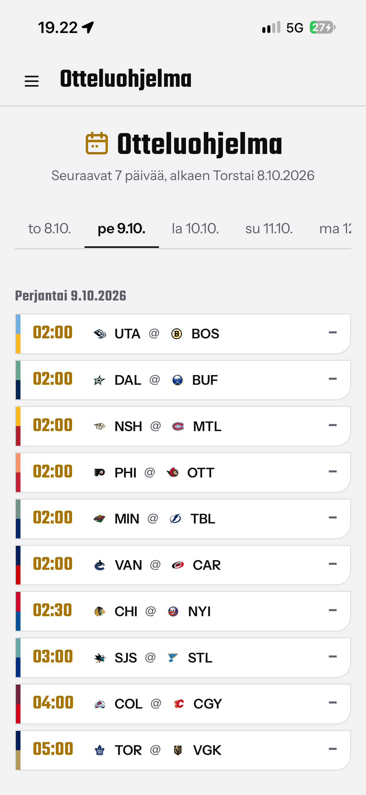 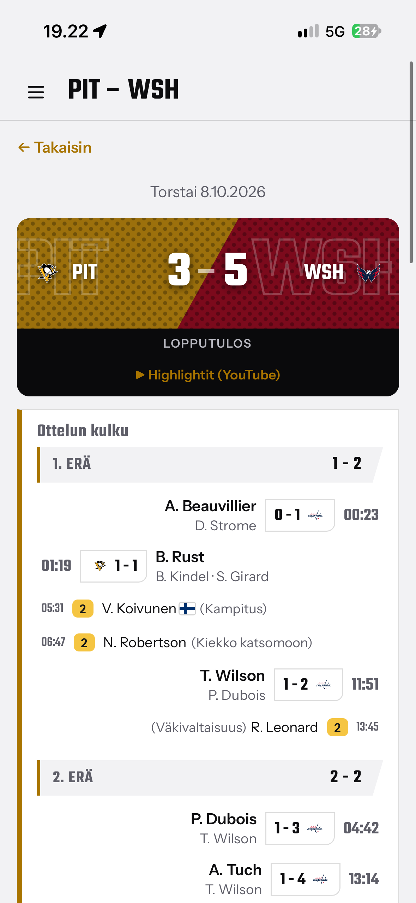 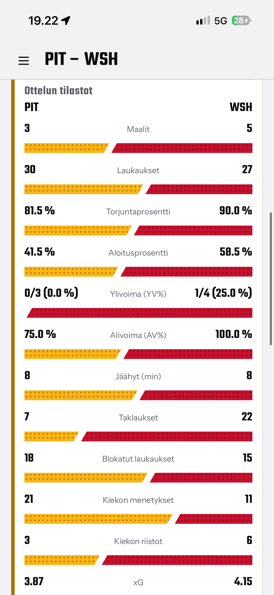 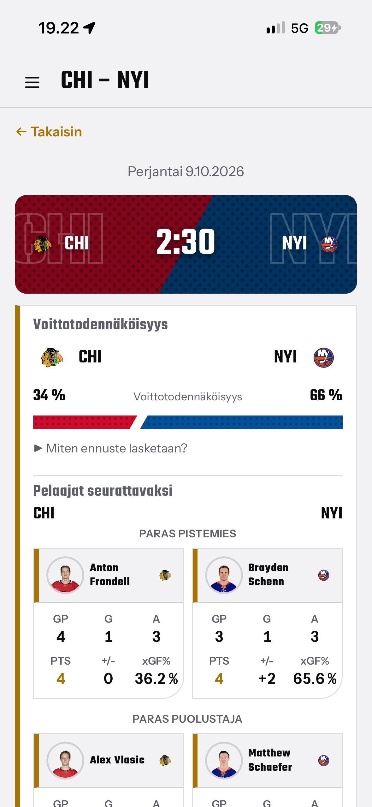

### Joukkue- ja pelaajasivut
- `/joukkueet` kaikki 32 joukkuetta divisioonittain, `/joukkueet/<lyhenne>` joukkuesivu
  (rosteri, kausitilastot, xG, ottelut; `/ottelut` koko kauden ohjelma)
- `/pelaajat/<id>` pelaajakortti: bio, kausi- ja uratilastot, ottelukohtainen loki,
  xG (hyökkääjät) tai GSAx (maalivahdit)

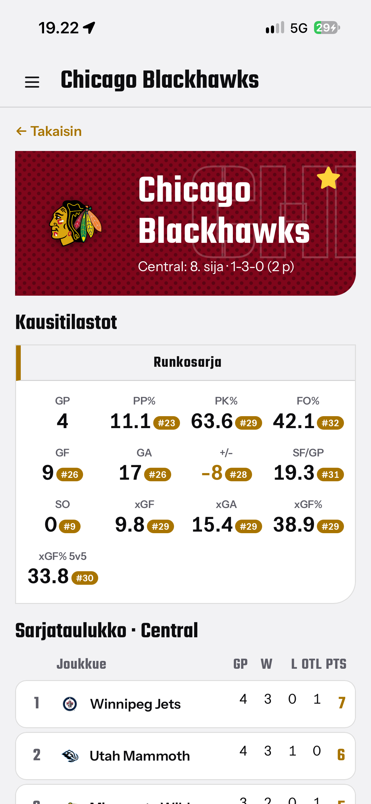 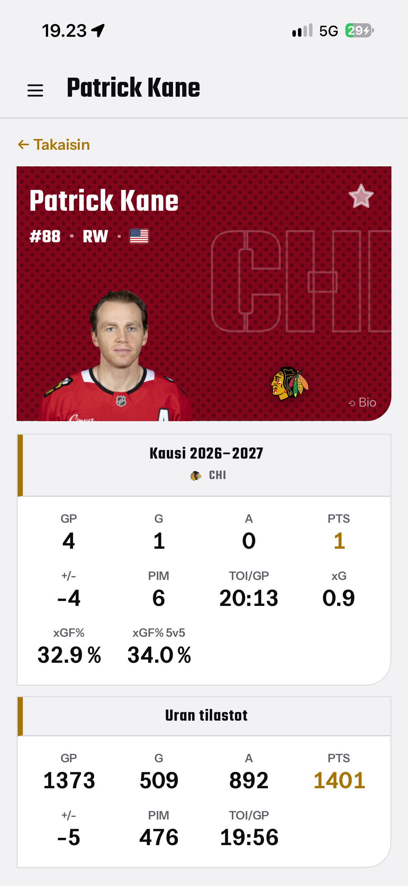

### Arkisto (`/arkisto`)
Kauden pelipäivät ja `/arkisto/<päivä>`: päivän ottelut ottelukortteina.

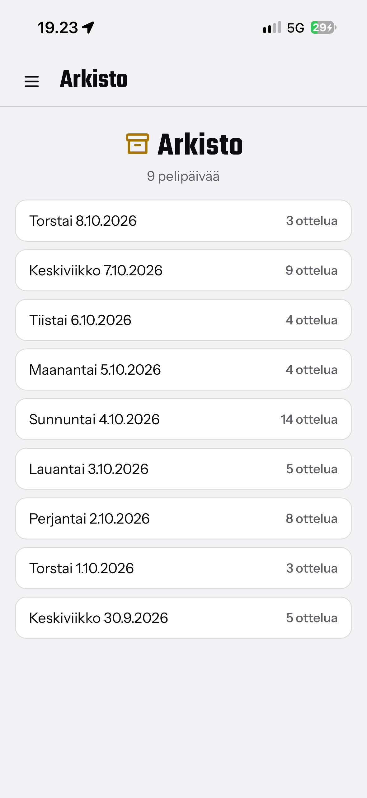

### Tili ja asetukset
- `/kirjaudu`: kirjautuminen ja rekisteröityminen yhdellä lomakkeella (tarkoituksella
  kevyt, ei tuotantotason tietoturvaa)
- `/omat` Asetukset: suosikkijoukkueet ja -pelaajat, teema (vaalea/tumma/järjestelmä),
  pörssien korostukset, tulospiilo ja bugiraportti
- `/tulospiilo`: edellisen kierroksen ottelut ilman tuloksia, vain highlights-linkki;
  tulos paljastuu kun "olen katsonut highlightit" on ruksattu

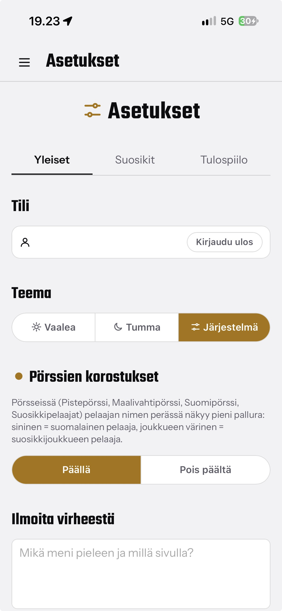 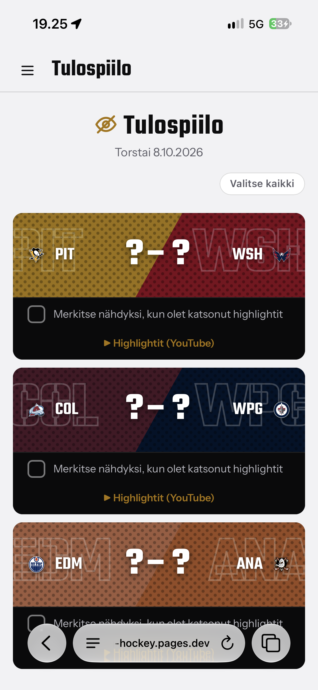

## Miten se toimii

```
Cloudflare Worker (cron-trigger/, Cron Triggers)
        │  kutsuu GitHub Actionsin workflow_dispatch-rajapintaa
        ▼
GitHub Actions (kolme synkkaa)
        │
        ├─ sync-fast-tier.yml   (10 min välein)  → games-taulu
        │     ottelutilanteet/-tulokset, pysyvä arkisto samalla
        │
        ├─ sync-slow-tier.yml   (2 h välein)     → kausitilastot
        │     sarjataulukko, pistepörssit, rookie-pörssi, rosterit,
        │     joukkueiden kausitilastot (kaikki 32 joukkuetta)
        │
        └─ sync-digest.yml      (6 h välein)     → suomalaiset pelaajat
              suomalaisten syöttö-/maalivahtirivit

Cloudflare D1 (SQLite)
        │
        └─ Cloudflare Pages Functions (web/) lukee D1:stä per-pyyntö
           ja renderöi HTML:n -- ei staattista build-vaihetta sivuston
           puolella. Ottelun raportti, pelaajakortti ja analytiikan
           pelaajakaavio haetaan lisäksi tarvittaessa suoraan NHL:n
           API:sta ja välimuistitetaan.
```

GitHub Actionsin oma `schedule`-ajastus osoittautui epäluotettavaksi
(tuntien viiveitä), joten workfloweissa on vain `workflow_dispatch` ja ajastuksen
hoitaa Cloudflare Workerin Cron Trigger.

Data haetaan [NHL:n julkisesta API:sta](https://github.com/Zmalski/NHL-API-Reference).
Python (`src/morning_hockey/`) hoitaa vain datan haun ja jalostuksen; jokainen
`sync_*.py`-skripti kutsuu valmiita `build_*`-funktioita ja kirjoittaa
tuloksen D1:een `d1_sync.py`:n kautta. Itse sivusto on TypeScript/Cloudflare
Pages Functions (`web/functions/`), joka lukee D1:tä suoraan Workersin omalla
bindingillä. Valinnainen `YOUTUBE_API_KEY` (Pages-secret) etsii ottelun oikean
NHL Highlights -videon; ilman sitä käytetään YouTube-hakulinkkiä.

## D1-taulut

`d1/schema.sql`:
- Ottelut: `games`, `game_box_scores` (ottelun raportin välimuisti),
  `youtube_highlights`
- Tilastot: `skater_season_stats`, `goalie_season_stats`, `rookie_season_stats`,
  `standings_rows`, `finnish_skater_stats`, `finnish_goalie_stats`
- Joukkueet: `team_roster_skaters`, `team_roster_goalies`, `team_season_stats`
- Digest: `digests`, `digest_games`, `digest_scorers`, `digest_goalies`
- xG/GSAx: `skater_game_xg`, `goalie_game_xg`, `team_game_xg` (joukkueen xGF/xGA, myös 5v5; ottelukohtaiset rivit, kausisummat lasketaan kyselyissä)
- Käyttäjät: `users`, `favorite_teams`, `favorite_players`, `user_settings`, `bug_reports`
- Välimuisti: `skater_game_log_cache` (analytiikan pistekaavio)
- Muut: `bingo_picks` (Pistemiesbingo), `game_win_prob` (otteluennakko)

## Projektin rakenne

```
src/morning_hockey/
  nhl_api.py          NHL API -asiakas (score/boxscore/roster-endpointit, cachettaa per-ajo)
  d1_sync.py           D1:n HTTP API -kirjoitusadapteri jokaiselle synkalle
  models.py             Jaetut tietomallit
  digest.py            Edellisen yön tulokset + suomalaiset pelaajat
  finnish.py            Suomalaisten pelaajien tunnistus rosterdatasta
  boxscore.py           Yksittäisen ottelun maali-/tilastoerittely
  league_stats.py       Liigan pistepörssi/maalivahtipörssi (top-N)
  rookies.py             Rookie-pörssi (NHL:n virallinen rookie-sääntö)
  standings.py            Sarjataulukko divisioonittain
  suomiporssi.py          Suomalaisten oma pistepörssi/maalivahtipörssi
  schedule.py             Otteluohjelma (rullaava 7+ päivää)
  team.py                 Joukkueiden rosterit + kausitilastot, kaikille 32
  sync_fast_tier.py       CLI: ottelut → D1 (10 min välein)
  sync_slow_tier.py       CLI: kausitilastot → D1 (2 h välein)
  sync_digest.py          CLI: suomalaiset → D1 (6 h välein)
  sync_xg.py              CLI: xG/GSAx → D1 (digest-workflow'ssa); `--backfill 20252026`, `--backfill-teams 20252026` (vain joukkuerivit), `--backfill-wp-inputs 20252026`
  winprob/                voittotodennäköisyysmalli (model_wp.json, tilat, D1-synkka)
  xg/                     xGoalBoost-mallit (models/), features.py (kopio sellaisenaan
                          xGoalBoostista) ja compute.py (play-by-play → xG-rivit)

web/
  functions/            Cloudflare Pages Functions (TypeScript), yksi
                         reitti/tiedosto per sivu, lukee env.DB:tä (D1):
                         index, suosikit, sarjataulukko, tilastot, maalivahtiporssi,
                         suomiporssi, odotetut, analytiikka, playoffit,
                         otteluohjelma, primetime, bingo, tulospiilo, arkisto/,
                         ottelut/, joukkueet/, pelaajat/, haku/, kirjaudu/, omat/
  functions/_shared/     Layout, muotoilu, autentikaatio, ottelun raportti,
                         box score -välimuisti, kuntopuntari (formGuide),
                         suosikit, bingo, xG, voittotodennäköisyys, YouTube,
                         jaetut komponentit
  public/static/         CSS + vanilla JS (app.js, analytiikka.js/D3), ei build-stepiä
  scripts/               Node-testit (boxscore, divisionPoints, formGuide)
  wrangler.toml           Pages-projektin D1-binding
  seed.local.sql          Paikallinen testidata (wrangler pages dev)

cron-trigger/          Cloudflare Worker, joka ajastaa kolme synkkaa
                        (Cron Triggers → GitHub workflow_dispatch)

d1/schema.sql          D1:n taulurakenne (ei ajeta automaattisesti --
                        uudet taulut/indeksit liitetään käsin Cloudflaren
                        D1 Console -välilehdellä)
tests/                 Pytest-yksikkötestit Python-puolelle
.github/workflows/
  sync-fast-tier.yml    Ottelut D1:een (Workerin ajastamana, 10 min)
  sync-slow-tier.yml    Kausitilastot D1:een (2 h)
  sync-digest.yml       Suomalaiset pelaajat + xG/GSAx D1:een (6 h)
  deploy-pages.yml       web/ → Cloudflare Pages jokaisella pushilla mainiin
  web-typecheck.yml      tsc + web-testit jokaisella web/-pushilla
  tests.yml               pytest jokaisella pushilla/PR:llä
```

## Käyttöönotto

1. **Luo Cloudflare-tili ja D1-tietokanta**, aja `d1/schema.sql` sen
   konsolissa (taulu/indeksi kerrallaan -- D1 Console ei tue
   multi-statement-erää).
2. **Aseta GitHub-secretit** (Settings → Secrets and variables → Actions):
   `CF_ACCOUNT_ID`, `CF_D1_DATABASE_ID`, `CF_API_TOKEN` (oikeudet: D1 edit +
   Cloudflare Pages edit).
3. **Aja synkat kerran käsin** (Actions-välilehti → kukin
   `Sync *-tier to D1` -workflow → Run workflow), niin D1:ssä on dataa
   ennen ensimmäistä sivulatausta.
4. **Pushaa `web/`-hakemistoon** — `deploy-pages.yml` luo Cloudflare
   Pages -projektin automaattisesti ensimmäisellä ajolla ja julkaisee sen.
5. **Ota ajastus käyttöön**: deployaa `cron-trigger/` Workerina
   (`npx wrangler deploy`) ja aseta sille secret `GITHUB_TOKEN`
   (`npx wrangler secret put GITHUB_TOKEN`, fine-grained PAT, vain Actions:
   read+write tälle repolle).
6. (Valinnainen) Aseta Pages-secret `YOUTUBE_API_KEY` oikeiden
   highlights-videoiden hakuun.

## Ajaminen paikallisesti

```bash
# Python-synkat
python -m venv .venv && source .venv/bin/activate
pip install -e ".[dev]"
pytest

CF_ACCOUNT_ID=... CF_D1_DATABASE_ID=... CF_API_TOKEN=... \
  python -m morning_hockey.sync_fast_tier

# Web-sovellus
cd web
npm install
npm run typecheck && npm test
npx wrangler d1 execute DB --local --file=../d1/schema.sql
npx wrangler d1 execute DB --local --file=seed.local.sql
npx wrangler pages dev public
```

## Ajastuksen muuttaminen

Ajastus on `cron-trigger/wrangler.toml`:n `crons`-listassa (UTC):
`*/10 * * * *` (fast), `0 */2 * * *` (slow), `0 */6 * * *` (digest).
Samat lausekkeet pitää päivittää täsmälleen samassa muodossa
`cron-trigger/src/index.ts`:n `WORKFLOW_BY_CRON`-karttaan. Jokaista synkkaa voi
myös laukaista käsin milloin vain: Actions-välilehti → valitse synkka → *Run
workflow*.

## xG ja GSAx

Mallit koulutetaan erillisessä xGoalBoost-repossa (`nhl_pbp/`), ja tähän repoon
on kopioitu vain valmiit mallitiedostot (`src/morning_hockey/xg/models/`) sekä
`features.py` muuttamattomana. Päivitys: kouluta uudelleen xGoalBoostissa,
kopioi `model_*.json`, `model_meta.json` ja `features.py`, päivitä
`tests/fixtures/golden_2024020001.csv` ja aja `sync_xg --backfill` kausille uudelleen.
Mallit on koulutettu kausilla 2023–24 – 2025–26 (AUC noin 0,79), vain runkosarja.
Arvoja ei skaalata kauden maalimäärään.

Backfill (tarvitsee `CF_*`-ympäristömuuttujat, ks. Ajaminen paikallisesti):

```
pip install -e ".[xg]"
python -m morning_hockey.sync_xg --backfill 20232024   # sama 20242025, 20252026
python -m morning_hockey.sync_xg --backfill-teams 20232024   # joukkue-xGF% jo xG-backfillatuille kausille (ei kirjoita pelaajarivejä uudelleen)
```

## Voittotodennäköisyys (otteluennakko)

Ennakkomalli kotijoukkueen voitolle (`src/morning_hockey/winprob/`, kertoimet
`model_wp.json` xGoalBoostin `winprob/train_wp.py`:stä; testit toistavat sen
laskennan). Logistinen regressio: joukkueiden eksponentiaalisesti painotetut
tulokset, maali-, xG-, 5v5-xG-, laukaus- ja DZ-giveaway-erot (puoliintumisajat
10 ja 40 peliä), maalivahdin taso (joukkueen 20 viimeisen aloittajan GSAx/100,
ei vahvistettua aloittajaa), back-to-back ja kotietu. Kausivaihteessa tilat
säilyvät 60 %, joten kausi alkaa edellisen kauden tiloista.

`sync_xg`-oletusajo (xG-vaiheiden jälkeen) lukee D1:stä kolmen viimeisen kauden
pelatut ottelut, laskee tilat ja kirjoittaa `game_win_prob`-rivin jokaiselle
pelaamattomalle (`games.is_finished = 0`) ottelulle; ottelun ennakko näyttää sen. Historia luetaan
vain tauluista `team_game_xg`, `goalie_game_xg` ja `team_game_wp_inputs` (tulos,
jatkoaika, laukaukset, DZ-giveawayt play-by-playstä; `d1/schema.sql`), koska
`games` sisältää vain käynnissä olevan kauden:

```
python -m morning_hockey.sync_xg --backfill-wp-inputs 20242025   # sama 20232024, 20252026
```

Vaihe on virhesietoinen: puuttuva taulu tai data ohittaa sen, xG-synkka ei kaadu.
